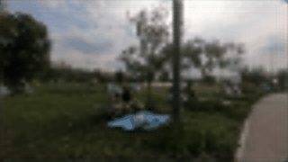

## ELSR: Extreme Low-Power Super Resolution Network For Mobile Devices


# ELSR-Paddle
This project is an implementation of the paper ["ELSR: Extreme Low-Power Super Resolution Network For Mobile Devices"](https://arxiv.org/abs/2208.14600) using Paddle. The code replicates the method proposed by the paper, but it is meant to be trained on limited devices. For that purpose the dataset is drastically smaller, and the training is way simpler.This code is modified from the original source code of Pytorch implementation(https://github.com/andreacoppari/ELSR-torch)

### Requirements
 - paddle
 - opencv
 - pillow
 - matplotlib


## Dataset
ELSR is trained on the REDS dataset, composed of sets of 300 videos, each set has a different degradation. This model is trained on a drastically reduced version of the dataset, containing only 30 videos with lower resolution (the original dataset was too big for me to train). The dataset (h5 files) is available at the following link: [https://drive.google.com/drive/folders/158bbeXr6EtCiuLI5wSh3SYRWMaWxK0Mq?usp=sharing](https://drive.google.com/drive/folders/158bbeXr6EtCiuLI5wSh3SYRWMaWxK0Mq?usp=sharing).


## Model
The ELSR model is a small sub-pixel convolutional neural network with 6 layers. Only 5 of them have learnable parameters. The architecture is shown in the image below:


### PixelShuffle
The PixelShuffle block (also known as depth2space) that performs computationally efficient upsampling by rearranging pixels in an image to increase its spatial resolution. Formally, let **x** be a tensor of size (**batch_size**, **C_in**, **H_in**, **W_in**), where **C_in** is the number of input channels, **H_in** and **W_in** are the height and width of the input, respectively. The goal of PixelShuffle is to upsample the spatial resolution of **x** by a factor of **r**, meaning that the output should be a tensor of size (**batch_size**, **C_out**, **H_in** * **r**, **W_in** * **r**), where **C_out** = **C_in** // **r^2**.


## Results
Due to the limited size of the dataset I wasn't able to replicate the papers results, but indeed there are interesting results proving that video-super-resolution can be done in such a small model. The graphs below are the training losses through each training step:


### Tests
```
python test.py
python test_video.py
```
The testing of single frame super-resolution is done in this way (video-sr is achieved by iterating sr on every frame):
 1. Resize the input image to (image.height // upscale_factor, image.width // upscale_factor) using Bicubic interpolation
 2. Calculate the bicubic_upsampled image of the previously produced low resolution image by the same upscaling factor using Bicubic interpolation
 3. Use the low resolution image to predict the sr_image
 4. Calculate PSNR between sr_image and bicubic_upsampled
The results are shown below:


The PSNR of the generated image has shown to be lower, but the resulting images are smoother, making bigger images better-looking:


Blurring stands out in pixelated images:


### Low-power real-time video super-resolution
Of course tests on videos have been done. To achieve "real-time" video-sr the model should be able to produce at least 30 FPS on edge devices, I couldn't test the model on mobile, but on GPU the video is produced at 2500+ FPS (see [project_report.ipynb](./project_report.ipynb)). GIFs below:

| Bicubic GIF: 28.20 dB  | ELSR GIF: 28.45 dB    |
| ------------- | ------------- |
|   |   |

## Project report
You can find a complete project report in [this notebook](./project_report.ipynb).
